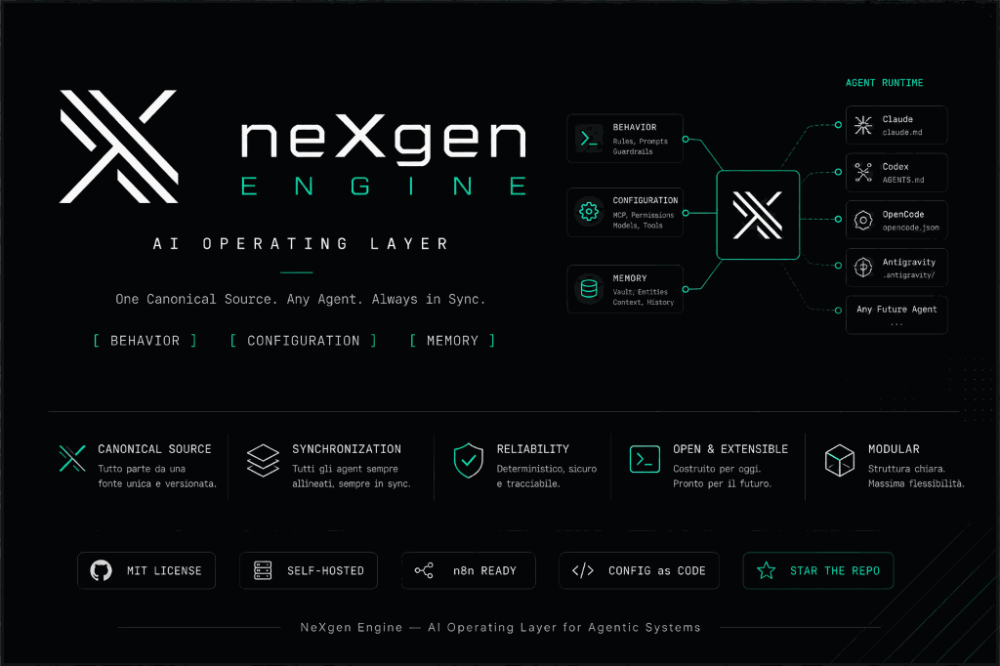

# NeXgen Engine, versione italiana

<p align="center">
  <picture>
    <source srcset="assets/nexgen-architecture-banner.webp" type="image/webp">
    
  </picture>
</p>

<p align="center">
  <a href="https://github.com/matteopasseri407/NeXgen-Engine/actions/workflows/ci.yml"></a>
  <a href="https://github.com/matteopasseri407/NeXgen-Engine/releases/latest"></a>
  <a href="LICENSE"></a>
  
</p>

<p align="center">
  <a href="README.md">🇬🇧 Read in English</a> · <a href="#guida-rapida">Guida rapida</a> · <a href="docs/architecture-contract.md">Architettura</a>
</p>

**Configura le CLI di coding AI da una sola sorgente Git e verifica il risultato.**

NeXgen Engine genera le configurazioni di Claude Code, Codex, OpenCode e Antigravity da un KnowledgeVault privato.
Il Vault contiene istruzioni condivise, manifest MCP e skill, segreti cifrati e memoria in Markdown.

Ogni CLI riceve il proprio formato nativo, mentre le impostazioni specifiche della macchina restano locali.
Il sync applica la configurazione; doctor controlla gli scostamenti e segnala ciò che non riesce a verificare.

---

## Le tre parti

Il motore tiene separate tre fonti di configurazione:

1. **Comportamento (Behavior):** Regole operative universali, prompt e guardrail immutabili definiti in `AGENTS.md` e collegati a ogni runtime.
2. **Configurazione (Configuration):** Manifest astratti di connettori MCP e skill, compilati in modo deterministico nei formati delle varie CLI tramite `nexgen sync`.
3. **Memoria (Memory):** KnowledgeVault in puro Markdown con blocco atomico compare-and-swap (CAS), aggiornamenti per singola sezione (`update_section`) e cronologia Git completa.

---

## Cosa fa

* **Core unico in Python (`nexgen_core`):** gira su Linux e Windows ed è verificato dalla suite CI.
* **Moduli deterministici:** catalogo di 9 moduli (`memory`, `semantic-rag`, `firecrawl`, `ocr`, `n8n`, `browser`, `council`, `local-lane`, `sync`) gestito con `nexgen modules list` e `nexgen modules set`.
* **Modelli locali, opzionali:** `nexgen-local` costruisce query in sola lettura e registra le fonti di ogni risposta.
  Il gate di valutazione fallisce se la suite trappole rileva un'injection o una risposta senza riscontro.
  Le proposte di patch richiedono approvazione tramite `nexgen-local propose` / `apply`.
  La ricerca conserva fonti, ricevute e proposte tra sessioni con `nexgen-local explore --session-id new`.
  Vedi [local-lane.md](docs/local-lane.md).
* **Segreti:** cifratura asimmetrica `age` (`99-SECRETS/secrets.yaml.age`) su chiavi locali (`0600`), slot OAuth isolati per host e `secrets.env` generato per shell e servizi.
  Non serve una passphrase.
* **Shell operatore:** dashboard `nexgen info` e REPL interattiva `nexgen shell`, così la gestione ordinaria non richiede mai una CLI AI aperta.
* **Quattro runtime:** Claude Code, Codex, OpenCode (nativo V2: istruzioni, `plugins`/`permissions`, viste skill) e Antigravity, ognuno nel suo dialetto, seggi Council inclusi.
* **Diagnostica (`nexgen doctor`):** controlli automatici su allineamento Git, manifest, link, token e permessi.
  Un controllo che non riesce a verificare dichiara un esito indeterminato.

---

## Guida rapida

### Opzione A, installazione

```bash
uv tool install git+https://github.com/matteopasseri407/NeXgen-Engine   # oppure: pipx install git+https://github.com/matteopasseri407/NeXgen-Engine
nexgen info
nexgen doctor
```

Il motore si installa da questo repository.
Le release includono un archivio sorgente, una wheel e `SHA256SUMS` per verificare i download.
La pubblicazione su PyPI e Homebrew è un canale separato, ancora da attivare, descritto in [release-packages.md](docs/release-packages.md).
Le installazioni come pacchetto si aggiornano tramite il gestore usato per installarle.

### Opzione B, clone

```bash
git clone https://github.com/matteopasseri407/NeXgen-Engine.git ~/KnowledgeVault
cd ~/KnowledgeVault
bash install.sh --check          # Windows PowerShell: .\install.ps1 -Check
```

Per i clone Git, `nexgen update` richiede conferma; il heartbeat pianificato può applicare aggiornamenti patch senza intervento.
Vedi [upgrade.md](docs/upgrade.md) per requisiti e recupero.

### 1. Inizializzazione

L'installer ha già eseguito l'inizializzazione.
Verifica:

```bash
nexgen sync
nexgen doctor --verbose
```

### 2. Configurazione guidata

Apri `INIT.md` e incolla il testo nella tua CLI preferita, Claude Code, Codex, OpenCode o Antigravity.
L'assistente guiderà la scelta del profilo e dei moduli.

### 3. Allineamento e verifica

```bash
nexgen sync
nexgen doctor
```

### 4. Gestione da terminale

```bash
nexgen info
nexgen shell
```

---

## Sviluppo

Lo sviluppo usa `developer`; le release arrivano su `main` tramite pull request verificata.
Il [contratto Git](docs/agent-lanes.md) descrive il lavoro concorrente e il riallineamento automatico con `main`.
Proprietari dei moduli e test richiesti sono in [CONTRIBUTING.md](CONTRIBUTING.md).

## Licenza

Il repository usa PolyForm Noncommercial License 1.0.0.
Consulta [LICENSE](LICENSE) per i termini e [COMMERCIAL.md](COMMERCIAL.md) per l'uso commerciale.
