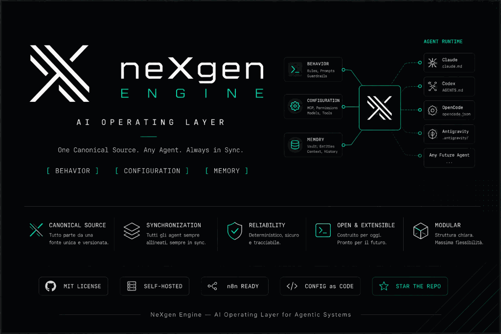
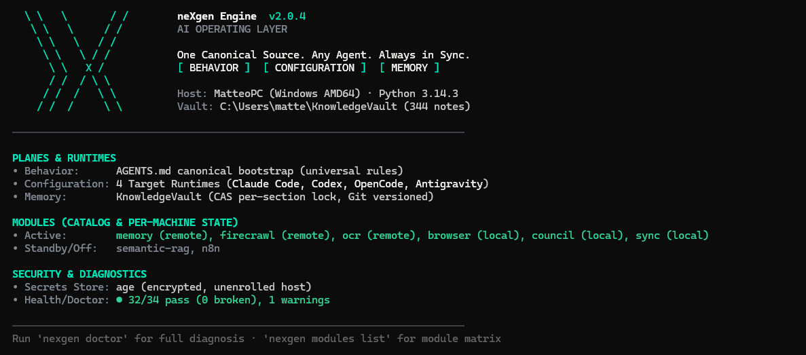

# NeXgen Engine

<p align="center">
  <picture>
    <source srcset="assets/nexgen-architecture-banner.webp" type="image/webp">
    
  </picture>
</p>

<p align="center">
  <a href="https://github.com/matteopasseri407/NeXgen-Engine/actions/workflows/ci.yml"></a>
  <a href="https://github.com/matteopasseri407/NeXgen-Engine/releases/latest"></a>
  <a href="https://github.com/matteopasseri407/NeXgen-Engine/stargazers"></a>
  <a href="LICENSE"></a>
  
  
</p>

<p align="center">
  <a href="README.it.md">🇮🇹 Leggi in italiano</a> · <a href="#quick-start">Quick Start</a> · <a href="#why-nexgen-vs-alternatives">Why NeXgen?</a> · <a href="docs/architecture-contract.md">Architecture</a> · <a href="CHANGELOG.md">Changelog</a>
</p>

**One Canonical Source. Any Agent. Always in Sync.**

NeXgen Engine is a deterministic AI Operating Layer that unifies instructions, tool configuration, secrets, and version-controlled memory across Claude Code, Codex, OpenCode, and Antigravity.

Instead of letting individual agent CLI configurations diverge across machines, NeXgen maintains a single source of truth in Git, compiled into each assistant's native format and verified by automated diagnostics.

---

## Demo

> Visual proof beats architecture diagrams. The two commands below are the whole product: see the state, fix the drift.

```bash
nexgen info    # visual dashboard: engine version, runtimes aligned, vault hygiene, secrets
nexgen shell   # interactive REPL [1-7] — manage everything without opening an AI assistant
nexgen doctor  # 33+ fail-closed checks: git alignment, MCP reachability, link hygiene, permissions
```

<p align="center">
  <picture>
    <source srcset="assets/nexgen-info-demo.webp" type="image/webp">
    
  </picture>
  <br><em><code>nexgen info</code> on Windows — Host, Vault (344 notes), Planes & Runtimes, Modules and Security & Diagnostics at a glance. Run <code>nexgen doctor</code> for full diagnosis.</em>
</p>

---

## The Three Planes

NeXgen structures agent operations into three decoupled planes:

1. **Behavior:** Universal operating policies, prompts, and invariant guardrails defined in `AGENTS.md` and symlinked into every runtime.
2. **Configuration:** Abstract MCP manifests and skills compiled deterministically into each CLI's native configuration format via `nexgen sync`.
3. **Memory:** Plain Markdown KnowledgeVault with compare-and-swap (CAS) concurrency locking, per-section updates (`update_section`), and automatic Git versioning.

```
                         ┌──────────────┐
                         │  AGENTS.md   │ ──► [ BEHAVIOR ]
                         └──────┬───────┘
                                │
   ┌────────────────────────────┼────────────────────────────┐
   │                            ▼                            │
   │                    ┌───────────────┐                    │
   │                    │ neXgen Engine │                    │
   │                    └───────┬───────┘                    │
   │                            │                            │
   ▼                            ▼                            ▼
[ CONFIGURATION ]         [ SECRETS ]                   [ MEMORY ]
MCP Manifests / Skills    Age Multi-Recipient Store     KnowledgeVault
Claude · Codex ·          Zero-Passphrase (0600)        CAS Locked Git Notes
OpenCode · Antigravity    Per-Host OAuth Slots          Link Hygiene Map
```

---

## How it compares

Different tools solve different slices. Small syncers are great for copying one MCP server quickly. NeXgen targets the full operating layer when you run multiple CLIs on multiple machines and want instructions, MCP, skills, secrets and memory to stay consistent.

| Capability | NeXgen Engine | AgentSync | mcp-sync | mcps-manager | dotfiles-ai |
|---|---|---|---|---|---|
| **MCP sync** | manifest `yaml` → native, 9 agents | symlink | auto-discover | bundle | — |
| **AGENTS.md / instructions** | canonical `AGENTS.md` + CAS | symlink | — | — | template |
| **Skills** | lazy catalog + `deps:` | yes | — | — | — |
| **Memory vault (Markdown+Git)** | CAS + `update_section` + `vault-map` | — | — | — | — |
| **Secrets `age` Zero-Passphrase** | multi-recipient `0600` + per-host OAuth | — | — | — | — |
| **Doctor diagnostics** | 33+ fail-closed checks | — | — | — | — |
| **Windows native** | verified + CI + dual launchers | community | Python | Node | community |
| **Tests** | 400+ unit tests | partial | — | — | — |
| **License** | PolyForm Noncommercial 1.0.0 | MIT | MIT | MIT | MIT |

*Capabilities as of Aug 2026 — contributions and corrections welcome. If you only need a lightweight MCP copy between two CLIs, a small syncer is the faster path. If you want zero drift across instructions, MCP, skills, secrets and memory with a doctor that fails closed, NeXgen covers all five in one place.*

---

## Key Features in v2.0.4

* **Unified Python Core (`nexgen_core`):** Pure Python implementation running natively across Linux and Windows with 400+ unit tests, eliminating shell script divergence.
* **Deterministic Modular Layer:** 8-module catalog (`memory`, `semantic-rag`, `firecrawl`, `ocr`, `n8n`, `browser`, `council`, `sync`) managed deterministically with `nexgen modules list` and `nexgen modules set`.
* **Zero-Passphrase Secrets Store:** Asymmetric `age` encryption (`99-SECRETS/secrets.yaml.age`) using machine-local hardware keys (`0600`), isolated per-host OAuth refresh token slots, and materialized `secrets.env` for shells and systemd services.
* **Visual CLI & Operator Shell:** Built-in `nexgen info` visual dashboard and standalone `nexgen shell` interactive REPL with selectable menu actions (`[1-7]`), enabling complete human management without opening an AI assistant.
* **Comprehensive Multi-Runtime Alignment:** First-class support for Claude Code, Codex, OpenCode, and Antigravity (including Council seat integration).
* **Fail-Closed Diagnostics (`nexgen doctor`):** 33+ automated sanity checks validating git alignment, manifest reachability, link hygiene, token presence, and permission boundaries.

---

## Quick Start

### Option A — Installed (recommended for daily use)

```bash
uv tool install nexgen-engine   # or: pipx install nexgen-engine
nexgen info
nexgen doctor
```

Updates via `nexgen update` (with confirmation) and via the scheduled `guard` task that runs at login + every 30 min.

### Option B — Cloned (recommended for hacking the engine)

```bash
git clone https://github.com/matteopasseri407/NeXgen-Engine.git ~/KnowledgeVault
cd ~/KnowledgeVault
bash install.sh --check          # Windows PowerShell: .\install.ps1 -Check
```

### 1. Bootstrap

Already done by the installer. Verify:

```bash
nexgen sync
nexgen doctor --verbose
```

### 2. Configure your environment

Open `INIT.md` and paste its contents into your preferred agent CLI (Claude Code, Codex, OpenCode, or Antigravity). The agent will guide you through profile selection and module setup.

### 3. Align and verify (anytime)

```bash
nexgen sync
nexgen doctor
```

### 4. Interactive operator shell

```bash
nexgen info
nexgen shell
```

---

## Platform Support

<!-- platform-status:start -->

| System | Status | On what evidence |
|---|---|---|
| Linux | **released** | the platform this is developed and used on daily; the full cycle (install, alignment, doctor, grooming, council, update) runs here and in CI |
| Windows | **released** | verified on real hardware and in CI; full native Python execution, dual launchers, and complete CLI alignment |
| macOS | **untested** | shares the POSIX paths with Linux and should work, but nobody has run it end to end; treat a failure here as expected, and reporting it as useful |

| Assistant | Status | What is covered |
|---|---|---|
| Claude Code | **complete** | instructions, MCP connectors, skills, guardrails |
| Codex | **complete** | instructions, MCP connectors, skills |
| OpenCode | **complete** | instructions, MCP connectors, skills |
| Antigravity | **complete** | instructions, MCP connectors, skills, and a Council seat; the seat was unblocked on 2026-08-22 with a stateless invocation (agy --model ... --disable-slash-commands --new-project --sandbox -p <prompt>) verified live with a nonce prompt |

<!-- platform-status:end -->

---

## Architecture Boundaries

* **No Lock-In:** All memories and configuration are stored as human-readable Markdown and YAML in Git.
* **Deterministic Write Paths:** Knowledge notes are modified exclusively via CAS hash verification to prevent race conditions.
* **Non-Invasive Execution:** The engine manages configuration as code above runtime execution; it does not intercept real-time model token streams.

See `docs/architecture-contract.md` and `docs/sync-contract.md` for the full contracts.

---

## FAQ

**Can I use this commercially?**
PolyForm Noncommercial 1.0.0 allows free noncommercial use, modification, and self-hosted deployments. Commercial use requires a separate agreement — see `COMMERCIAL.md` and `LICENSE`. The Python packaging and CLI tooling are intended to stay MIT-compatible; the engine's orchestration layer is noncommercial by design.

**How is this different from dotfiles?**
Dotfiles sync files. NeXgen syncs *semantics*: one `AGENTS.md`, one MCP manifest, one skills manifest — compiled to each CLI's native dialect (JSON/TOML/YAML, different paths on Linux vs Windows), with drift detection and fail-closed guardrails. A symlink farm cannot do that.

**Do I need all four CLIs?**
No. Install only what you use — `nexgen doctor` warns (not fails) for absent CLIs. Adding a runtime later is one `nexgen sync`.

---

## License

PolyForm Noncommercial License 1.0.0. Free for noncommercial use, modification, and self-hosted deployments. See `LICENSE` for details. For commercial inquiries see `COMMERCIAL.md`.
