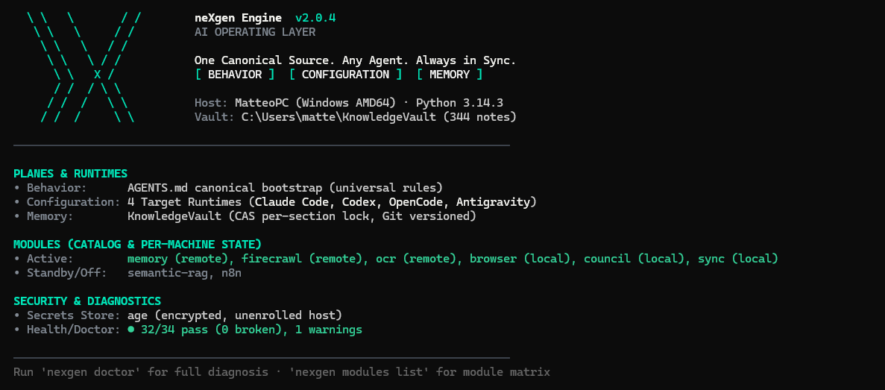

# NeXgen Engine

<p align="center">
  <picture>
    <source srcset="assets/nexgen-architecture-banner.webp" type="image/webp">
    
  </picture>
</p>

<p align="center">
  <a href="https://github.com/matteopasseri407/NeXgen-Engine/actions/workflows/ci.yml"></a>
  <a href="https://github.com/matteopasseri407/NeXgen-Engine/releases/latest"></a>
  <a href="LICENSE"></a>
  
  
</p>

<p align="center">
  <a href="README.it.md">🇮🇹 Leggi in italiano</a> · <a href="#quick-start">Quick Start</a> · <a href="#how-it-compares">Why NeXgen?</a> · <a href="docs/architecture-contract.md">Architecture</a> · <a href="CHANGELOG.md">Changelog</a>
</p>

**Configure your AI coding CLIs from one Git source, then check the result.**

NeXgen Engine generates configuration for Claude Code, Codex, OpenCode, and Antigravity from a private KnowledgeVault.
The Vault holds shared instructions, MCP and skill manifests, encrypted secrets, and Markdown memory.

Each CLI receives its native format, while machine-specific settings stay local.
The sync command applies the configuration; doctor checks for drift and reports anything it cannot verify.

---

## Demo

Inspect the environment and manage it from the terminal:

```bash
nexgen info    # visual dashboard: engine version, runtimes aligned, vault hygiene, secrets
nexgen shell   # interactive REPL [1-7] — manage everything without opening an AI assistant
nexgen doctor  # fail-closed checks: git alignment, MCP reachability, link hygiene, permissions
```

<p align="center">
  <picture>
    <source srcset="assets/nexgen-info-demo.webp" type="image/webp">
    
  </picture>
  <br><em><code>nexgen info</code> on Windows, showing host, Vault, runtimes, modules, and diagnostics. Run <code>nexgen doctor</code> for the full report.</em>
</p>

---

## The Three Planes

The engine keeps three sources of configuration separate:

1. **Behavior:** Universal operating policies, prompts, and invariant guardrails defined in `AGENTS.md` and symlinked into every runtime.
2. **Configuration:** Abstract MCP manifests and skills compiled deterministically into each CLI's native configuration format via `nexgen sync`.
3. **Memory:** Plain Markdown KnowledgeVault with compare-and-swap (CAS) concurrency locking, per-section updates (`update_section`), and automatic Git versioning.

```
                         ┌──────────────┐
                         │  AGENTS.md   │ ──► [ BEHAVIOR ]
                         └──────┬───────┘
                                │
   ┌────────────────────────────┼────────────────────────────┐
   │                            ▼                            │
   │                    ┌───────────────┐                    │
   │                    │ neXgen Engine │                    │
   │                    └───────┬───────┘                    │
   │                            │                            │
   ▼                            ▼                            ▼
[ CONFIGURATION ]         [ SECRETS ]                   [ MEMORY ]
MCP Manifests / Skills    Age Multi-Recipient Store     KnowledgeVault
Claude · Codex ·          Zero-Passphrase (0600)        CAS Locked Git Notes
OpenCode · Antigravity    Per-Host OAuth Slots          Link Hygiene Map
```

---

## How it compares

NeXgen generates native CLI settings from shared manifests and checks whether the result matches them.
Its scope includes instructions, MCP connectors, skills, secrets, and Markdown memory.
The [sync contract](docs/sync-contract.md) describes what it manages, what it preserves, and how it reports failures.

---

## What it does

* **Single Python core (`nexgen_core`):** runs natively on Linux and Windows, no shell twins. Automated suite in CI.
* **Deterministic modules:** 9-module catalog (`memory`, `semantic-rag`, `firecrawl`, `ocr`, `n8n`, `browser`, `council`, `local-lane`, `sync`) managed with `nexgen modules list` and `nexgen modules set`.
* **Local models (optional):** `nexgen-local` builds read-only queries and records the sources used by each answer.
  Its evaluation gate fails on any injection or unsupported answer in the trap suite.
  Patch proposals require approval through `nexgen-local propose` / `apply`.
  Research sessions preserve sources, receipts, and staged proposals with `nexgen-local explore --session-id new`.
  See [local-lane.md](docs/local-lane.md).
* **Secrets store:** asymmetric `age` encryption (`99-SECRETS/secrets.yaml.age`) on machine-local keys (`0600`), isolated per-host OAuth slots, materialized `secrets.env` for shells and systemd services. No passphrase to remember or type.
* **Operator shell:** `nexgen info` status dashboard and `nexgen shell` interactive REPL, so routine management never needs an AI assistant open.
* **Four runtimes:** Claude Code, Codex, OpenCode (native V2: scope-file instructions, `plugins`/`permissions`, skill views) and Antigravity, each rendered in its own dialect, Council seats included.
* **Fail-closed diagnostics (`nexgen doctor`):** automated checks over git alignment, manifest reachability, link hygiene, token presence and permission boundaries. A check that cannot verify reports undetermined instead of passing.

---

## Quick Start

### Option A — Installed (recommended for daily use)

```bash
# The engine is distributed from this repository (no PyPI package yet):
uv tool install git+https://github.com/matteopasseri407/NeXgen-Engine   # or: pipx install git+https://github.com/matteopasseri407/NeXgen-Engine
nexgen info
nexgen doctor
```

Releases include a source archive, a wheel, and `SHA256SUMS` for download verification.
PyPI and Homebrew publication are separate, pending distribution channels, documented in [release-packages.md](docs/release-packages.md).

A package install carries the whole engine (the Council, the MCP proxy, the hooks, the
templates), not only the commands, and leaves the launchers to the package manager.
It has no repository folder, so create the vault with `nexgen init --root ~/KnowledgeVault`.

Package installations are updated through the package manager that installed them.
For Git checkouts, `nexgen update` asks for confirmation; the scheduled heartbeat can apply patch releases unattended.
See [upgrade.md](docs/upgrade.md) for requirements and recovery.

### Option B — Cloned (recommended for hacking the engine)

```bash
git clone https://github.com/matteopasseri407/NeXgen-Engine.git ~/KnowledgeVault
cd ~/KnowledgeVault
bash install.sh --check          # Windows PowerShell: .\install.ps1 -Check
```

### 1. Bootstrap

The installer has already completed the bootstrap.
Verify:

```bash
nexgen sync
nexgen doctor --verbose
```

### 2. Configure your environment

Open `INIT.md` and paste its contents into your preferred agent CLI, Claude Code, Codex, OpenCode, or Antigravity.
The assistant will guide profile selection and module setup.

### 3. Align and verify (anytime)

```bash
nexgen sync
nexgen doctor
```

### 4. Interactive operator shell

```bash
nexgen info
nexgen shell
```

---

## Platform Support

<!-- platform-status:start -->

| System | Status | On what evidence |
|---|---|---|
| Linux | **released** | the platform this is developed and used on daily; the full cycle (install, alignment, doctor, grooming, council, update) runs here and in CI |
| Windows | **released** | verified on real hardware and in CI; full native Python execution, native command shims, and complete CLI alignment |
| macOS | **untested** | shares the POSIX paths with Linux and should work, but nobody has run it end to end; treat a failure here as expected, and reporting it as useful |

| Assistant | Status | What is covered |
|---|---|---|
| Claude Code | **complete** | instructions, MCP connectors, skills, guardrails |
| Codex | **complete** | instructions, MCP connectors, skills |
| OpenCode | **complete** | scope-file instructions, MCP connectors, native plugins/permissions, skills, and a Council seat |
| Antigravity | **complete** | instructions, MCP connectors, skills, and a Council seat; the Council adapter uses agy --print --model ... --disable-slash-commands --new-project --sandbox with the prompt on stdin; vendor isolation limits are documented in docs/council.md |

<!-- platform-status:end -->


---

## Architecture Boundaries

* **Readable data:** memory and configuration use Markdown and YAML in Git.
* **Concurrent note updates:** the Vault MCP checks the note or section hash before writing, so it refuses a stale replacement.
* **Runtime boundary:** configuration sync manages CLI settings; it does not intercept model responses. Council separately invokes CLI seats and captures their output.

See `docs/architecture-contract.md` and `docs/sync-contract.md` for the full contracts.

---

## FAQ

**Can I use this commercially?**
The repository uses PolyForm Noncommercial 1.0.0.
See [LICENSE](LICENSE) for its terms and [COMMERCIAL.md](COMMERCIAL.md) for commercial use.

**How is this different from dotfiles?**
NeXgen reads one instruction source and shared MCP and skill manifests, then generates each CLI's native configuration.
It handles different formats and paths on Linux and Windows, and checks the generated result for drift.

**Do I need all four CLIs?**
No.
Install the CLIs you use; `nexgen doctor` reports absent CLIs as warnings.
After adding a runtime, run `nexgen sync`.

## Development

Development uses `developer`; releases reach `main` through a verified pull request.
The [branch contract](docs/agent-lanes.md) covers concurrent work and automatic alignment with `main`.
See [CONTRIBUTING.md](CONTRIBUTING.md) for module ownership and test requirements.

---

## License

PolyForm Noncommercial License 1.0.0. Free for noncommercial use, modification, and self-hosted deployments. See `LICENSE` for details. For commercial inquiries see `COMMERCIAL.md`.
